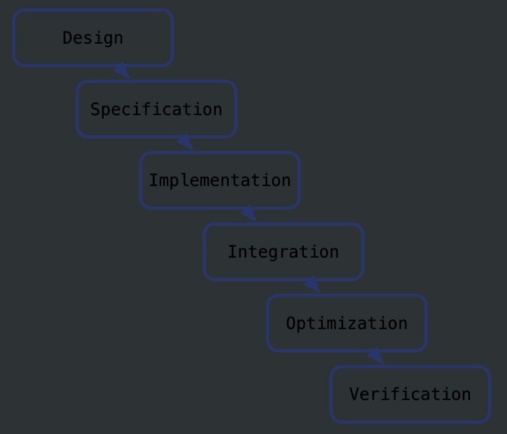
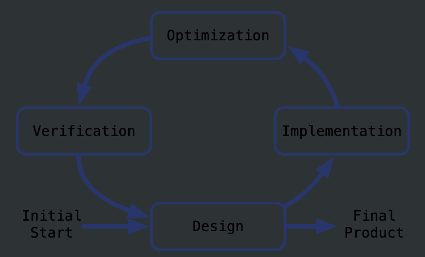

# CSE 228A 课程介绍与讲解

CSE 228A课程聚焦于**敏捷硬件设计（Agile Hardware Design）**，旨在教授如何运用敏捷方法应对当代硬件设计中的复杂挑战。本节课的主题包括课程的动机、敏捷设计的优势以及课程结构的概览。

## 课程动机：现代硬件设计为何需要敏捷方法？

硬件设计的复杂性与日俱增，先进设计的需求无处不在，从消费电子到高性能嵌入式设备，设计的创新性和效率至关重要。

### 先进设计的应用领域

现代技术需求推动了硬件设计在以下领域的广泛应用：

1. **移动设备（Mobile）**
   手机等移动设备对计算能力、功耗优化和小型化要求极高。设计需兼顾性能与便携性。
2. **数据中心（Datacenter）**
   数据中心对硬件设计提出了极高的性能和能效要求，以支持大规模计算、云服务和AI模型的训练。
3. **物联网（Internet of Things, IoT）**
   智能手表、恒温器等物联网设备的设计需要低功耗、小型化和高度的功能集成。
4. **高性能嵌入式系统（High-Performance Embedded）**
   无人驾驶汽车和无人机等设备需要专用硬件支持实时计算和可靠运行，设计需针对性优化。

这些领域都需要灵活高效的硬件设计方法，而敏捷设计可以应对多变的需求和复杂性，提供解决方案。

## 硬件设计面临的挑战

### 1. **摩尔定律的潜在终结（Potential Demise of Moore's Law）**

摩尔定律预测晶体管密度每18-24个月翻一番。然而，这一定律的影响正逐渐减弱，带来以下挑战：

- 即使摩尔定律继续，**晶体管的能效提升速度变慢**，导致单位能量下的性能提高不显著。
- 因此，设计需要通过**专用化（specialization）**等手段提升能效，以满足新应用场景的需求。

### 2. **设计成本的上升（Rising Costs of Design）**

- 随着工艺节点的进步，**先进工艺技术节点的设计成本显著增加**，这对小型企业或面向小众市场的设计项目构成障碍。
- 并非所有产品都能具备足够大的市场规模以支持高昂的设计成本。

### 3. **硬件设计领域的停滞风险（Stagnation）**

- 在硬件设计需求增加的情况下（例如为提升效率），高昂的设计成本却减少了潜在设计师的数量，形成矛盾。
- **解决方案**：通过**更低成本的设计流程**降低硬件设计的准入门槛，使更多设计得以实现。

### 敏捷硬件设计的优势

通过敏捷设计方法，可以快速响应不断变化的需求，灵活调整设计方向。敏捷设计特别适合当前复杂多变的硬件设计场景，能够在短时间内提供迭代成果，从而减少风险并提高效率。

## 对比两种设计哲学：瀑布模型与敏捷方法

现代硬件设计的哲学方法主要分为两种：**瀑布模型（Waterfall）\**和\**敏捷方法（Agile）**。两者的核心区别在于设计的规划性与灵活性，下面通过具体案例进行详细比较。

### 瀑布模型（Waterfall）

瀑布模型强调**提前的详细规划**，以确保整个设计和实施过程平稳无误。这种方法适合那些设计需求明确、不可轻易更改的项目。

#### 特点

1. **全面的前期设计**
   在开始实施之前，需要进行详细的需求分析和设计建模，确保所有可能的风险和问题都被考虑到。
2. **线性流程**
   瀑布模型具有明确的阶段划分，如需求分析、设计、实施和测试，每个阶段依次进行且不可逆。

#### 案例：大坝建设

- **背景**：土木工程师在设计和建设大坝时，需要确保施工的顺利进行。

- 过程：

  - 仔细设计并建立大坝的模型。
  - 使用模具进行测试和优化，保证设计可靠。

- **关键点**：混凝土一旦浇筑，就无法轻易修改，因此需要在实施之前进行彻底的规划和验证。

#### 局限性

瀑布模型的最大挑战在于**缺乏灵活性**。一旦需求发生变化，返工的成本和代价非常高，这种模型难以适应动态变化的需求。

### 敏捷方法（Agile）

敏捷方法的核心在于**无法提前掌握完美的设计方案**，而是通过不断调整和迭代来适应需求和环境的变化。它是一种以灵活性和适应性为中心的设计哲学。

### 特点

1. **灵活性与适应性**
   在设计和实施过程中，不断根据实际情况调整目标和方法。
2. **强调实时反馈**
   敏捷方法注重快速交付可用的部分成果，通过迭代的方式逐步完善设计。

### 案例：竞技运动员

- **背景**：在竞技比赛中，运动员无法提前预测对手的策略和动作。

- 过程：

  - 提前进行训练和准备，但始终为变化做好适应准备。
  - 根据对手的行为实时调整策略。

- **关键点**：在不确定的环境中，敏捷方法强调快速反应和调整能力，以适应瞬息万变的情况。

### 优势

敏捷方法特别适用于需求不断变化或难以明确的项目，它通过逐步迭代减少风险，并快速验证设计的可行性。

### 瀑布模型与敏捷方法的对比总结

| 特点         | 瀑布模型（Waterfall）      | 敏捷方法（Agile）            |
| ------ | -------------- | ---------------- |
| **规划程度** | 需求和设计需全面规划       | 强调灵活调整                 |
| **适用场景** | 需求明确、变更风险低的项目 | 需求多变、不确定性高的项目   |
| **优点**     | 稳定性高，减少后期变更成本 | 高灵活性，能快速适应变化     |
| **缺点**     | 灵活性差，变更成本高       | 初期规划不够详细可能带来风险 |

## 瀑布模型（Waterfall）流程

瀑布模型是一种**线性设计流程**，强调在完成一个阶段的所有工作后，才能进入下一个阶段。这种方法在硬件设计中非常传统，适用于需求明确且设计过程较为可预测的项目。

### 流程说明

瀑布模型的流程包括以下步骤：

1. **设计（Design）**
   从总体构想到详细的硬件结构设计，明确所有需求和参数。
2. **规范定义（Specification）**
   根据设计定义详细的技术规范，为后续实现提供具体的标准。
3. **实现（Implementation）**
   根据定义的规范进行硬件开发和制造。
4. **集成（Integration）**
   将设计的各部分集成起来，形成一个完整的系统。
5. **优化（Optimization）**
   针对集成后的系统进行性能调整和优化。
6. **验证（Verification）**
   测试硬件是否满足设计要求，确保其功能性和可靠性。

### 特点与局限

- **特点**：
  - 每个阶段严格分离，需完成前一阶段后才能进入下一阶段。
  - 适合需求明确、变更少的项目，例如大规模生产的硬件产品。
- **局限**：
  - **延迟集成的问题**：由于集成发生在后期，任何问题都会延续到最后，导致需要重新优化和验证。
  - **缺乏灵活性**：在需求或设计发生变化时，整个流程需要从头调整，带来高昂的时间和成本代价。

## 敏捷方法（Agile）流程

敏捷方法强调**循环迭代**和**灵活应对**，在设计早期就进行集成和验证，不断优化和完善。这种方法非常适合需求多变、开发环境动态的硬件设计项目。

### 流程说明

敏捷方法并非线性，而是一个不断循环迭代的过程，包括：

1. **设计（Design）**
   开始初步设计，并保留对后续调整的开放性。
2. **实现（Implementation）**
   将设计转化为可运行的硬件或原型。
3. **优化（Optimization）**
   根据早期实现的结果进行性能调整，发现并解决问题。
4. **验证（Verification）**
   早期测试并验证设计的功能和性能。
5. **循环迭代**
   不断返回设计阶段，根据验证结果重新调整和完善设计，直到最终形成满意的产品。

### 特点与优势

- **特点**：
  - **早期集成和验证**：在设计的初期就进行测试，尽早发现和解决问题。
  - **增量开发**：通过逐步添加功能和优化设计，降低风险并适应变化。
  - **灵活迭代**：设计过程可以多次循环，直到达到最终目标。
- **优势**：
  - **适应性强**：能快速应对需求和环境的变化。
  - **风险降低**：早期发现问题，避免后期的大规模返工。

### 瀑布模型与敏捷方法的对比总结

| **比较维度**     | **瀑布模型（Waterfall）**      | **敏捷方法（Agile）**            |
| ---------- | --------------- | ----------------- |
| **流程结构**     | 线性、阶段式                   | 循环、迭代式                     |
| **适用场景**     | 需求明确、变更少               | 需求多变、不确定性高             |
| **开发灵活性**   | 灵活性较低，无法快速适应变化   | 灵活性高，可随时调整方向         |
| **问题发现时间** | 晚期发现问题，解决成本高       | 早期发现问题，风险低             |
| **优点**         | 稳定、适合长期规划的项目       | 动态应对、减少返工，提高开发效率 |
| **缺点**         | 对变化的适应能力差，返工成本高 | 初期规划可能不充分，需频繁迭代   |

### 选择设计哲学的关键考虑因素

1. **需求的稳定性**：
   如果需求明确且稳定，瀑布模型可能更为高效；但若需求可能频繁变化，敏捷方法更合适。
2. **时间与成本限制**：
   敏捷方法通过早期测试和验证减少返工，适合时间紧张的项目；而瀑布模型适用于长期规划且有充裕时间的项目。
3. **团队的技能与文化**：
   敏捷方法需要更高的协作能力和灵活性，适合快速反应的团队；瀑布模型则更适合流程明确的传统团队。

通过理解这两种设计哲学的特点，可以根据项目需求选择适合的流程，或结合两者的优点，制定高效的硬件设计策略。

## 敏捷技术的核心启示

敏捷技术强调设计过程中需要灵活性和快速响应，特别是在硬件设计中面临以下不确定性时具有重要意义：

### **1. 目标的动态变化**

- **需求的变化性**：终端目标通常不是一成不变的，需要不断调整以适应新环境或技术。

- 关键问题：

  - 当前设计如何适配新技术实现？
  - 关键路径的时序问题如何解决？
  - 是否可以在设计阶段简化验证流程？

### **2. 硬件设计的流动性与灵活性**

- **传统硬件设计的僵化**：如同“编写 Verilog 就像浇筑混凝土”，一旦完成便很难修改。
- **敏捷设计的新工具与语言**：通过更灵活的工具和语言（如高级硬件描述语言），硬件设计可以变得更加敏捷和可调整。

### **3. 成功的跨领域经验**

- 敏捷技术在软件开发中广泛应用，证明其对复杂、快速变化需求的适应性。
- 在硬件设计中借鉴这些经验，将使设计流程更加高效。

### 敏捷技术在硬件设计中的潜力

敏捷方法为硬件设计带来了多方面的改进潜力：

### **1. 减少设计工作量**

- 避免在非必要的组件或优化上浪费精力。
- 聚焦于高价值的设计内容，减少冗余开发。

### **2. 提升设计结果**

- 通过更合理的资源分配优化设计性能。
- 实现基于性能分析的优化（如利用运行时分析工具指导设计决策）。

### **3. 提高设计流程的可预测性**

- 在流程早期就开始组件集成，减少后期整合的意外问题。
- 每个阶段的持续反馈有助于预测设计整体的最终表现。

通过这些潜力，敏捷方法在硬件设计中的应用可以显著提升设计效率和产品质量。

## 开源与设计民主化的结合

**敏捷技术**和**开源**是两种独立的概念，但它们的结合能为硬件设计带来深远影响。

### **1. 敏捷与开源的定义与协同**

- **敏捷**：用于快速迭代的设计技术，注重灵活性和反馈。

- **开源**：公开可用的技术和组件，支持广泛的开发者社区。

- 两者的结合：

  - 敏捷方法可以在闭源或开源工具中应用。
- 开源工具与专有组件的结合能加速开发，并降低设计门槛。

### **2. 降低设计成本与民主化**

- 敏捷技术与开源共同作用，显著减少硬件设计成本：
  - **敏捷**：通过快速迭代减少时间浪费。
  - **开源**：通过共享资源降低开发工具和组件的成本。
- 成本的降低带来以下效果：
  - 更多开发者和企业能够参与设计，形成更广泛的创新生态。
  - 更丰富的设计团队和创意，推动硬件设计的多样性和高效性。
  敏捷技术通过其灵活性和迭代特性，将显著改变硬件设计领域的传统流程。同时，开源技术的结合为更多人提供了参与硬件设计的机会，降低了进入门槛。通过敏捷方法和开源技术的协同作用，硬件设计的未来将更加高效、开放和多元化，为技术创新注入新的活力。

## 通过复用提升生产力：硬件设计的高效策略

在硬件设计中，**组件复用（Reuse）**是提升生产力的关键因素。复用不仅可以显著减少开发时间，还能将更多的精力集中在设计的创新部分。以下内容详细分析复用的益处、硬件生成器的作用以及其在设计流程中的应用。

### 为什么复用能提升生产力？

### Q: **开发速度最快的硬件模块是什么？**

**A:** 可复用的硬件组件。

复用现有组件避免了重复实现相同的功能模块，使设计人员可以专注于项目的独特需求与创新设计。

### **复用的核心原则**

1. **减少重复实现**：避免重新设计或实现已有的硬件组件。

2. **专注于创新**：将时间和资源集中在设计中新的或独特的部分。

3. 复用的关键条件：

   - 复用的组件必须能够正确实现所需功能。

- 确保复用的组件能无缝融入当前设计流程。

复用不仅节省时间，也降低了开发的复杂性，但对组件的质量和功能正确性的要求极高。

## 硬件生成器：提升复用性的工具

**硬件生成器（HW Generators）**是解决复用挑战的关键工具，尤其是当现有组件无法完全满足需求时。

### **硬件生成器的优势**

1. **灵活性**：生成器可以根据设计需求动态定制硬件组件，提供更高的复用性。

2. **适应性强**：生成器能生成多种不同配置的硬件模块，使其适合多种应用场景。

3. 与开源结合：

   - 开源生成器提升了复用的吸引力，为设计社区提供了强大的灵活性。

- 更大的社区支持促进了设计资源的共享，并分摊了设计成本。

### **设计生成的新概念**

- 通过编写程序在受控条件下生成硬件设计。
- 生成器不仅提供定制能力，还显著减少了手动设计的重复工作。

硬件生成器的核心在于将设计自动化嵌入到流程中，从而进一步提高复用效率。

## 生成器在硬件设计流程中的角色

硬件生成器在设计工具链中成为了重要的一环，被视为设计生成的一个关键步骤。

### **设计生成：工具链中的一部分**

- 将生成器纳入硬件设计工具链，可以显著提高设计效率。
- 设计生成不仅是工具流中的一个过程，也是加速创新的催化剂。

### **Chisel：硬件生成器的代表工具**

- **Chisel**（**C**onstructing **H**ardware **I**n a **S**cala **E**mbedded **L**anguage）是一种硬件生成语言，它结合了面向对象和函数式编程的优势。

- 语言特性：

  - 嵌入式于 Scala 语言中，具备强大的静态类型系统和推断能力。
  - 支持交互式开发，配合 REPL 或 Jupyter 提供强大的测试能力。

- 主要优势：

  - 单一语言环境内完成硬件生成的整个过程。
- 适用于下一代硬件设计语言，已经获得了显著的行业采用。

### **Scala 的作用**

- Scala 是运行在 JVM 上的高级语言，支持强类型和灵活的交互式开发。
- 使用 Scala 的 Chisel 提供了更高效的硬件生成能力，是现代设计工具链的重要组成部分。
复用和硬件生成器共同构成了硬件设计的高效策略。通过复用现有组件，可以显著降低开发成本；而硬件生成器则通过提供灵活定制能力进一步扩展了复用的范围。像 Chisel 这样的生成器工具，不仅促进了开源和社区共享，还通过自动化设计生成加速了硬件设计的迭代过程。这些方法和工具结合起来，为硬件设计提供了更强的灵活性和生产力保障，为现代复杂系统的开发铺平了道路。

## 课程主题概览与适合人群

CSE 228A课程围绕现代硬件设计的核心原则展开，强调灵活性、复用性和高效性。课程的设计主题贯穿始终，帮助学生从理论到实践全面掌握敏捷硬件设计方法。以下详细介绍课程的四大核心主题及适合学习本课程的背景要求。

### 贯穿课程的四大主题

### 1. **闭环设计（Close the Loop）**

- 核心思想：通过迭代和修订改进设计，而非追求过于复杂的初始设计。

  - 设计是一个不断优化的过程，不能依赖“一次完成”的思路。
  - 通过逐步调整，资源分配更高效，设计结果更加完善。

- 实际意义：

  - 帮助设计师理解各个模块如何协同工作，逐步发现并修复问题。
- 迭代带来更灵活和可靠的硬件设计。

### 2. **为复用而设计（Design for Reuse）**

- 核心思想：复用稳健的设计模块可提高生产力并减少错误。

  - 优化现有组件的复用性，例如通过硬件生成器为不同需求定制模块。
  - 在复用中引入必要的灵活性，增强模块的通用性。

- 实际意义：

  - 减少重复工作，节约设计时间和资源。
- 提高模块化设计的标准化程度，使得项目合作更顺畅。

### 3. **让工具为设计服务（Make the Tools do the Work）**

- 核心思想：充分理解并利用工具的功能，寻找机会自动化重复性任务。

  - 高效工具可以极大地减少人工错误，并加快开发速度。
  - 硬件生成器、仿真工具和高级语言如Chisel，能显著提升设计效率。

- 实际意义：

  - 将精力集中在设计的核心创新部分，而非基础重复工作。
- 借助工具优化流程，从而更快地验证设计并进行迭代。

### 4. **注重可读性设计（Design for Readability）**

- 核心思想：代码的可读性至关重要，代码被阅读的次数远远多于其被编写的次数。

  - 清晰的代码逻辑和文档有助于团队合作和设计复用。
  - 功能和意图必须清楚明了，以便设计的长期维护。

- 实际意义：

  - 减少调试和理解代码的成本。
- 提高代码质量，使得未来的修改和扩展更加容易。

## 适合学习本课程的人群

本课程对学习者的背景有一定要求，以下是推荐的基础知识领域：

1. **硬件设计（Hardware Design）**
   - 需要具备Verilog/VHDL等硬件描述语言的基础知识，例如完成过CSE 100/L或CSE 125/L相关课程。
   - 了解基本的硬件设计流程和实现方式。
2. **计算机体系结构（Computer Architecture）**
   - 需要对计算机系统架构有基本理解，例如CSE 120（操作系统）或CSE 220（计算机体系结构）课程背景。
   - 了解处理器、内存、I/O等硬件模块的工作原理。
3. **高级编程（Advanced Programming）**
   - 具备面向对象编程和函数式编程的基础知识。
   - 能够快速学习和应用新编程语言，如Scala，用于硬件生成工具（如Chisel）。
   本课程的核心目标是帮助学生掌握现代硬件设计中的敏捷方法，并通过工具和生成器实现高效的硬件开发。课程适合有一定硬件设计背景的学生，尤其是那些希望了解如何提升设计复用性、工具自动化和代码可读性的人士。通过系统学习，学生将能够应对现代硬件设计中的复杂挑战，成为敏捷硬件开发领域的专家。

## 课程团队与结构详细介绍

CSE 228A课程由经验丰富的硬件设计领域专家指导，结构合理，提供实验、作业和项目等多种学习形式，帮助学生从理论走向实践，全面掌握敏捷硬件设计的方法与工具。

### 课程团队

**主讲人：Scott Beamer**

- **职位**：计算机工程系助理教授

- **研究方向**：计算机体系结构、开源硬件设计、图形处理

- **邮箱**：[sbeamer@ucsc.edu](mailto:sbeamer@ucsc.edu)

- 办公时间：

  - 周一：下午3:30-4:30
  - 周三：下午2:30-3:30
  - 地点：E2-229

- 学生还可以在课后直接向教授提问，获取即时答疑支持。

### 课程结构

#### **课程类型**

- 本课程是面向研究生的选修课程，同时欢迎高年级本科生参与。
- 课程宗旨：学习过程中注重趣味性与创新性，激发学生对硬件设计的兴趣。

#### **主要学习活动**

- **讲座**：传授理论知识，涵盖敏捷硬件设计的核心概念。
- **实验（Labs, 10%）**：通过动手实践理解工具和技术的使用。
- **作业（Homework, 40%）**：设计较复杂的硬件项目，巩固理论与实践结合。
- **项目（Project, 50%）**：团队合作完成一个自定义的硬件生成器，展示综合能力。

#### **时间划分**

1. **结构化学习部分**（前6-7周）：
   包括讲座、实验和作业，帮助学生打下坚实的理论和工具基础。
2. **项目部分**（最后4周）：
   学生与搭档合作开发一个硬件生成器，课程团队会提供指导和反馈。
3. **持续调整**：
   课程将根据学生反馈动态调整教学内容，实际践行敏捷方法。

### 实验（Labs）

实验部分是课程的重要组成部分，为学生提供了尝试新功能和工具的机会：

- 任务特点：

  - 每个实验只需要编写几行代码，聚焦核心功能。
  - 学生可合作讨论，但需独立提交结果。

- 工具支持：

  - 使用 Jupyter Notebook 提供即时反馈，帮助学生快速理解问题和解决方案。

- 提交时间：

  - 应尽早完成实验，以确保有时间完成后续的作业。

### 作业（Homework）

作业比实验更具挑战性，设计更复杂的硬件项目，要求学生独立完成，但可以利用课程资源寻求帮助：

- 提交要求：

  - 作业通过 Chisel 编写并提交到 Gradescope。

- 测试支持：

  - 提供部分测试用例，学生需根据需求编写额外测试。

- 延迟政策：

  - 每位学生有3天的延迟额度，用于处理不可避免的延迟情况。

### 项目（Project）

课程项目是学生实践综合能力的核心部分，通过一个完整的设计过程提升对硬件生成器的理解：

- 任务要求：

  - 与搭档合作，设计并实现一个基于 Chisel 的硬件生成器。
  - 选择一个具体目标并开发满足需求的生成器。

- 演示与提交：

  - 学生需向全班展示项目并提交代码。
  - 鼓励（但不强制）将代码开源，回馈社区。

- 价：

  - 项目帮助学生整合实验和作业中学到的技能，完成一个实际的硬件设计。

### 课程资源

为帮助学生高效学习，课程提供以下资源：

1. 公共网站：

   - 包含讲座录音、实验、作业和参考资料。
   - 提供环境配置的详细说明。

2. Canvas平台：

   - 注册学生专用，用于提交作业和获取 Slack 讨论组的访问权限。

3. 持续更新：

   - 两个网站均在课程进行中不断完善，确保学生获得最新的学习资源。

### 学习目标（具体化）

本课程的主要目标是帮助学生从问题或构想到实现实际的硬件设计，重点在以下能力的培养：

1. 硬件生成器开发：

   - 学会设计能够支持自定义和优化的硬件生成器。

2. 硬件组件设计：

   - 掌握使用 Chisel 设计硬件组件的能力。

3. 设计技术：

   - 熟悉工具链、持续集成（CI）、代码审查和验证等现代设计技术。
