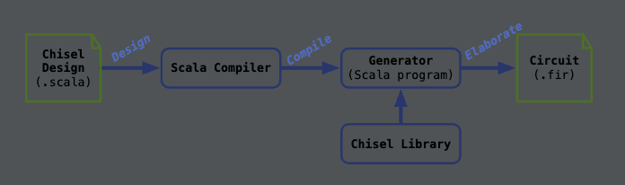
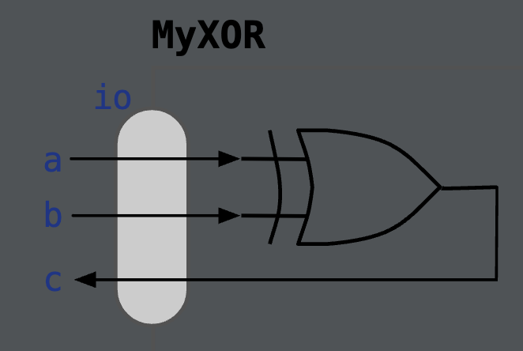
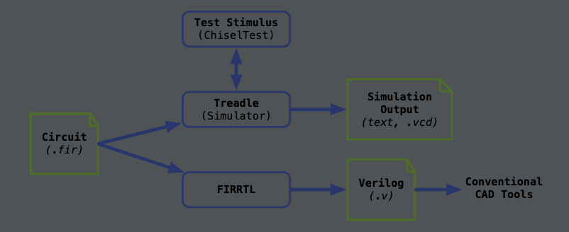

# Scala语言与Chisel简介

在敏捷硬件设计中，**Scala**语言和**Chisel**框架是实现高效硬件生成器开发的关键工具。本次内容旨在介绍Scala语言的特点、选择它的理由，以及其执行机制。同时，结合Chisel简要展示其如何支持硬件模块的构建与测试，实践“闭环设计（Close the Loop）”理念。

## 今日课程计划

- **Scala语言概览**：了解Scala的核心特性及其在硬件设计中的应用。
- **Chisel框架简介**：认识Chisel如何简化硬件设计的流程和模块生成。
- **实践环节**：构建并测试一个简单的Chisel模块，体验敏捷开发的闭环设计过程。

## Scala语言概览

### **语言特性（Language Features）**

Scala是一种高级语言，结合了面向对象和函数式编程的优势，并具有以下特点：

1. **面向对象**：支持类、对象、继承等面向对象的编程特性。

2. **强静态类型系统**：帮助在编译时捕获潜在错误，确保程序的可靠性。

3. **函数式编程支持**：提供如高阶函数、不可变数据结构等现代编程功能。

4. **运行在JVM上**：

- 与Java程序完全兼容，可调用Java类库。
  - 程序被编译为字节码，在Java虚拟机（JVM）上执行。

5. **编译时错误检测**：在编译阶段尽可能捕捉潜在错误，减少运行时问题。

### **为何选择Scala？**

Scala在硬件设计中具有多方面的优势，尤其是在开发嵌入式领域专用语言（DSL）方面：

1. **支持嵌入式DSL开发**：
   Chisel是一种基于Scala实现的嵌入式DSL，利用Scala的灵活语法实现高效的硬件生成器。
2. **面向对象与函数式编程结合**：
   提供构建复杂生成器（Generators）所需的抽象和灵活性。
3. **强大的类型系统**：
   确保代码的安全性，同时标准库的集合操作简化了开发工作。

Scala的这些特性使其成为硬件生成器开发的理想选择。

### Scala的执行机制

Scala的执行主要分为两种机制：标准编译与解释执行。

#### **1. 标准编译 -> 执行**

- 编译过程：

  - 将Scala程序编译为Java字节码，运行在JVM上。

- 代码结构要求：

  - 程序需要组织在类中，并包含一个`main`方法作为入口点。

- 构建工具与开发环境：

  - 通常使用`SBT`（Simple Build Tool）或IDE（如IntelliJ IDEA）进行构建和运行。

#### **2. REPL（Read-Eval-Print Loop）**

- REPL简介：

  - Scala支持交互式解释执行，可以逐行输入并立即查看结果。

- 课程中使用的工具：

  - 通过扩展Jupyter Notebook的**Almond**内核，可以在隔离环境中运行Scala代码片段。

REPL机制非常适合实验性开发和快速测试新功能，是硬件设计过程中必不可少的工具。

### 实践环节：Chisel模块的构建与测试

通过结合Scala语言和Chisel框架，本课程将实践“**闭环设计（Close the Loop）**”的核心理念：

1. **快速原型开发**：使用Chisel设计一个简单的硬件模块，例如加法器或计数器。
2. **测试与迭代**：利用Chisel的仿真工具对模块进行功能验证，发现问题并进行修正。
3. **闭环设计**：将构建、验证和优化过程整合为一个快速迭代的循环。

## Scala 基础：字面量、类型推断与变量声明

Scala语言作为一种支持面向对象和函数式编程的现代语言，具有灵活的语法和强大的类型系统。以下内容介绍Scala中的基本数据类型、类型推断机制和变量声明的原则，这些是使用Scala进行硬件设计的基础知识。

### Scala 字面量（Literals）

Scala 支持多种简单类型的字面量，语法直观，常用类型包括：

#### **常见简单类型**

- **整数类型（Int, Long, Byte）**：表示整数。
- **浮点数类型（Float, Double）**：表示小数。
- **字符类型（Char）**：单个字符。
- **字符串类型（String）**：一串字符。

#### **语法特点**

- Scala 中分号是可选的，通常不需要显式书写。

- 示例：

  ```scala
  2 + 3      // 整数加法，结果为 5
  5.0 / 2    // 浮点数除法，结果为 2.5
  "hello"    // 字符串字面量
  ```

字面量是Scala代码中的基本组成部分，直接表达常量值。

### Scala 类型推断（Type Inference）

Scala 是一种**强静态类型语言**，所有变量的类型在编译时必须确定，但它支持类型推断，允许开发者省略类型声明。

#### **关键特性**

1. **一切皆对象**：
   即使是简单类型（如整数和浮点数），在Scala中也被视为对象。

2. **编译时解析类型**：
   所有类型必须在编译时已知，但 Scala 编译器会根据上下文推断类型，无需显式声明。

3. 语法注意：

   - 类型声明放在变量名之后，而不是之前（与C/Java不同）。

   - 示例：

     ```scala
     val a = 4           // 自动推断为 Int 类型
     val b: Float = 4    // 显式声明类型为 Float
     val c = 4.0         // 自动推断为 Double
     val d = 'A'         // 自动推断为 Char
     ```

### **类型转换**

Scala 支持通过方法调用进行类型转换，例如：

```scala
4.toFloat   // 将 Int 转换为 Float，结果为 4.0
```

类型推断让代码更简洁，但同时保留了静态类型语言的安全性。

### Scala 变量声明（Declaring Variables）

Scala 中变量的声明分为**可变变量（var）**和**不可变变量（val）**两种，提倡优先使用不可变变量。

#### **1. 可变变量（var）**

- 特点：

  - 可以在初始化后重新赋值，类似于传统编程语言中的变量。

- 示例：

  ```scala
  var mutX = 0
  mutX = 2    // 重新赋值
  ```

- 劣势：

  - 容易导致状态的不确定性，增加调试难度，因此在Scala中不推荐使用。

#### **2. 不可变变量（val）**

- 特点：

  - 声明后不可重新赋值，类似常量。
  - 提升代码安全性，支持编译器进行更激进的优化。

- 示例：

  ```scala
  val constX = 42
  // constX = 50  // 错误：val 变量不能重新赋值
  ```

- 优势：

  - 避免意外修改，增强代码可读性和可维护性。

- 在函数式编程中尤为重要，符合"只写一次"的语义。
Scala 提供了灵活的语法和强大的类型系统，通过类型推断减少了代码冗余，而推荐使用不可变变量则提高了程序的安全性和可维护性。这些特性为硬件设计中的可靠性和高效性提供了保障。在后续课程中，这些基础知识将被用于硬件生成器的开发以及Chisel的模块设计。

## Chisel 简介：基于 Scala 的硬件设计语言

**Chisel**（Constructing Hardware in a Scala Embedded Language）是一种嵌入式硬件设计语言，构建于 Scala 语言之上。通过充分利用 Scala 的特性，Chisel 提供了高效的硬件设计和生成能力。以下深入分析 Chisel 的特点、工具链以及如何在交互式环境中加载 Chisel 库。

### Chisel 与 Scala 的关系

1. **嵌入式语言的定义**：
   - Chisel 的设计完全基于 Scala，所有的 Chisel 代码本质上是 Scala 程序。
   - 硬件设计的过程实际上是通过调用 Chisel 库操作生成硬件电路。
2. **语言优势的继承**：
   - Scala 的语法特性，如运算符重载和简洁的表达式语法，使得 Chisel 的使用体验接近于原生硬件描述语言。
   - 例如，Chisel 可以通过简洁的表达式定义复杂的硬件行为，降低了编写 Verilog 的复杂性。
3. **操作的灵活性**：
   - 使用 Chisel 时，可以直接利用 Scala 的面向对象特性和函数式编程工具，比如高阶函数和不可变数据结构，这为硬件生成器（Generator）的实现提供了极大的灵活性。

简而言之，Chisel 将硬件设计嵌入 Scala 的编程环境中，从而结合了高级语言的灵活性和硬件设计的严谨性。

## Chisel 工具链的前端流程

Chisel 的设计流程涉及多个步骤，最终将硬件设计转换为可以仿真或实现的格式文件。



### 工具链流程

1. **Chisel 设计（Chisel Design，`.scala` 文件）**：
   - 编写 Scala 程序，利用 Chisel 库定义硬件模块。
   - 示例：设计一个简单的加法器模块。
2. **Scala 编译器（Scala Compiler）**：
   - 将 `.scala` 文件编译为标准的 Scala 程序，供生成器执行。
3. **生成器（Generator）**：
   - 运行编译后的 Scala 程序，调用 Chisel 库生成硬件描述的具体实例。
   - 示例：生成描述加法器行为的具体电路。
4. **生成电路文件（Circuit，`.fir` 文件）**：
   - `.fir` 文件是硬件电路的中间描述，可以交付给后端工具进行仿真、综合和实现。

### 中间文件 `.fir` 的作用

- **硬件实例的描述**：
  - `.fir` 文件是 Chisel 生成的硬件电路描述文件，代表具体的设计实例。
  - 它可以进一步转化为更底层的硬件描述语言（如 Verilog）或者用于仿真和实现。
- **传递到后端工具链**：
  - 仿真：可以直接在工具中验证电路的功能和性能。
  - 综合：交付给 FPGA 或 ASIC 后端工具进行物理实现。

`.fir` 文件的生成使得 Chisel 设计的硬件能无缝集成到主流的硬件设计工具链中。

## 在 Notebook 中加载 Chisel 库

### **加载 Chisel 环境**

为了在交互式 Notebook 中使用 Chisel，必须先加载所需的 Scala 和 Chisel 库：

1. **加载依赖模块**：

   ```scala
   interp.load.module(os.Path(s"${System.getProperty("user.dir")}/../resource/chisel_deps.sc"))
   ```

   - `interp.load.module` 方法将所需的依赖引入当前工作环境。
   - 确保系统路径包含 Chisel 所需的库资源。

2. **导入 Chisel 包**：

   - 在 Notebook 中导入以下 Chisel 库以使用其核心功能：

     ```scala
     import chisel3._
     import chisel3.util._
     import chiseltest._
     import chiseltest.RawTester.test
     ```

### **模块说明**

- **`chisel3._`**：核心库，提供基本的硬件构造工具。
- **`chisel3.util._`**：额外的工具包，包含常用的硬件模块和功能，如计数器和移位寄存器。
- **`chiseltest._`**：测试库，用于对设计进行功能验证。

加载这些库后，用户可以在交互式环境中构建、测试和迭代硬件设计。

## Chisel 设计的优势

1. **模块化与复用**：
   - Chisel 的生成器功能允许开发者通过编程生成可定制的硬件模块，提高复用性并降低设计复杂度。
2. **简洁的语法**：
   - Chisel 的语法更接近高层次语言，避免了传统硬件描述语言中冗长的代码书写。
3. **强大的工具链支持**：
   - 通过与 Scala 编译器和后端仿真工具集成，Chisel 的工具链简化了从设计到实现的全过程。
4. **灵活的测试环境**：
   - 借助交互式 Notebook 和 Chisel Test，设计者可以快速验证硬件模块的正确性，支持敏捷开发的快速迭代。
   通过对 Chisel 的深入理解与实践，学生可以在硬件设计中高效构建复杂模块，并通过工具链完成电路的生成和验证，这为现代硬件设计提供了极具价值的解决方案。

## Chisel 基础类型与操作符简介

在 Chisel 中，硬件设计语言基于简单而强大的类型系统，支持表达逻辑信号和整数的硬件数据。以下详细介绍 Chisel 的基础数据类型及操作符，帮助理解如何在硬件设计中使用它们进行高效的描述和计算。

### Chisel 的基础数据类型

Chisel 中的数据类型与硬件设计中的基本数据类型一一对应，用于描述信号的值、范围和逻辑行为。

#### **1. `Bool` 类型**

- 表示单比特逻辑信号，用于布尔逻辑运算。

- 关键点：

  - `Bool` 是 Chisel 专用类型，与 Scala 的 `Boolean` 不同。
  - 必须显式将 Scala 字面量转换为 Chisel 的 `Bool` 类型（后缀 `.B`）。

- 示例：

  ```scala
  val myBool: Bool = true.B    // 定义一个逻辑高信号
  val anotherBool = 0.B        // 定义一个逻辑低信号
  ```

#### **2. `UInt` 类型**

- 表示无符号整数信号，用于描述位宽明确的整数。

- 关键点：

  - 可通过显式或隐式方式设置位宽。
  - 位宽设置使用 `.W` 后缀。

- 示例：

  ```scala
  val myUInt: UInt = 4.U          // 定义无符号整数，默认推断位宽
  val myUInt8 = 6.U(8.W)          // 定义一个 8 位宽无符号整数
  ```

#### **3. `SInt` 类型**

- 表示有符号整数信号，用于表示需要正负值的硬件信号。

- 关键点：

  - 与 `UInt` 类似，但支持符号扩展。

- 示例：

  ```scala
  val mySInt = -2.S               // 定义有符号整数，默认推断位宽
  val mySInt8 = (-2).S(8.W)       // 定义一个 8 位宽有符号整数
  ```

Chisel 的类型系统允许开发者精确控制硬件信号的位宽，这对硬件优化至关重要。

### Chisel 的操作符（Operators）

Chisel 提供了一套强大的操作符，用于描述硬件信号的逻辑、算术、位操作和关系运算等功能。这些操作符与常见编程语言的操作符类似，但在硬件设计上下文中具有不同的语义和注意事项，尤其是在**位宽处理**方面。

#### **1. 常见逻辑操作符**

逻辑操作符用于处理布尔逻辑信号（`Bool` 类型），适用于单比特逻辑运算。

- **操作符**：`!`（非）、`&&`（与）、`||`（或）

- 示例：

  ```scala
  val result = a && b    // 逻辑与操作
  val inv = !a           // 逻辑非操作
  ```

- **应用场景**：逻辑控制、条件判断。

#### **2. 算术操作符**

算术操作符用于 `UInt`（无符号整数）或 `SInt`（有符号整数）的加减乘除等数学运算。

- **操作符**：`+`、`-`、`*`、`/`、`%`

- 示例：

  ```scala
  val sum = a + b        // 加法操作
  val diff = a - b       // 减法操作
  ```

- 注意事项：

  - **溢出处理**：当操作结果的位宽超出目标信号的位宽时，Chisel 会自动截断高位。
  - **除法限制**：除法 (`/`) 和取模 (`%`) 运算的硬件实现复杂，可能需要额外的资源优化。

#### **3. 位操作符**

位操作符直接作用于信号的每一位，适用于 `UInt` 和 `SInt` 类型。

- **操作符**：`~`（按位非）、`&`（按位与）、`|`（按位或）、`^`（按位异或）

- 示例：

  ```scala
  val andBits = a & b    // 按位与操作
  val orBits = a | b     // 按位或操作
  val xorBits = a ^ b    // 按位异或操作
  val invBits = ~a       // 按位取反操作
  ```

- **应用场景**：位掩码操作、数字编码处理。

#### **4. 移位操作符**

移位操作符用于实现信号的逻辑左移或右移，适合处理多位信号。

- **操作符**：`<<`（左移）、`>>`（右移）

- 示例：

  ```scala
  val shiftedLeft = a << 2   // 左移两位，相当于乘以 4
  val shiftedRight = a >> 2  // 右移两位，相当于除以 4
  ```

- 注意事项：

  - 左移会增加信号的位宽，而右移会丢弃低位。
  - 对 `SInt` 类型的右移操作为算术移位（保留符号位）。

#### **5. 关系操作符**

关系操作符用于比较两个信号的大小或相等性。

- **操作符**：`===`（等于）、`=/=`（不等于）、`<`（小于）、`<=`（小于等于）、`>`（大于）、`>=`（大于等于）

- 注意：

  - Chisel 中的 `===` 和 `=/=` 不同于 Scala 的 `==`。
  - 用于硬件描述的比较结果返回 `Bool` 类型信号。

- 示例：

  ```scala
  val isEqual = a === b    // 判断是否相等
  val isNotEqual = a =/= b // 判断是否不相等
  val isGreater = a > b    // 判断 a 是否大于 b
  ```

#### **6. 其他操作符**

Chisel 提供了一些特殊操作符，简化硬件信号的复杂操作。

#### **信号提取与连接**

- 提取信号的特定位：

  ```scala
  val extractedBits = a(3, 0)  // 提取 a 的第 0 到第 3 位
  ```

- 连接多个信号：

  ```scala
  val concatenated = Cat(a, b) // 将 a 和 b 按位连接
  ```

#### **多路选择器（Mux）**

- **功能**：根据条件信号选择输出信号。

- 语法：

  ```scala
  val selected = Mux(sel, a, b) // 如果 sel 为 1，输出 a，否则输出 b
  ```

#### **信号归约**

- 对信号的每一位进行归约操作：

  ```scala
  val allOnes = a.andR    // 所有位按位与的结果
  val anyOnes = a.orR     // 任一位为 1 的结果
  val xorReduce = a.xorR  // 所有位按位异或的结果
  ```

### **位宽注意事项**

硬件操作符的结果通常会涉及信号位宽的自动扩展或截断：

1. 自动扩展：某些操作（如加法）会自动扩展结果位宽，以容纳完整结果。
   - 例如：`a + b` 的结果位宽为 `max(a 的位宽, b 的位宽) + 1`。
2. 自动截断：对于固定位宽的目标信号，结果超出位宽时会丢弃高位。
   - 需要开发者小心设计以避免无意的溢出或数据丢失。

### 注意：Chisel 运算必须在 `Module` 内部

在 Chisel 中，所有硬件信号的运算必须在模块（`Module`）内进行，否则不会生成有效的硬件电路。例如：

```scala
val a = 7.U
val b = 5.U
// a + b  // 错误：此操作需在 Module 内
```

解决方法是在 Chisel 的 `Module` 定义内进行操作：

```scala
class MyModule extends Module {
  val io = IO(new Bundle {
    val a = Input(UInt(8.W))
    val b = Input(UInt(8.W))
    val sum = Output(UInt(8.W))
  })

  io.sum := io.a + io.b  // 在 Module 中定义加法操作
}
```

通过掌握 Chisel 的基础类型和操作符，设计者可以精确控制硬件信号的行为和位宽。结合模块化开发，这些工具为复杂硬件设计提供了强大的表达能力和高效的开发流程。

## 初探 Chisel 模块：实现第一个硬件模块

Chisel 的强大之处在于它将硬件设计模块化、程序化。以下通过构建一个简单的 XOR 模块，演示如何使用 Chisel 定义、生成并可视化硬件设计。该过程展示了从输入/输出接口的定义到功能实现的完整流程。

### 1. 定义第一个 Chisel 模块



**代码实现：一个 XOR 模块**

```scala
class MyXOR extends Module {
  val io = IO(new Bundle {
    val a = Input(Bool())   // 定义输入 a，类型为 Bool
    val b = Input(Bool())   // 定义输入 b，类型为 Bool
    val c = Output(Bool())  // 定义输出 c，类型为 Bool
  })
  
  io.c := io.a ^ io.b        // XOR 操作：输出 c 为 a 和 b 的按位异或
}
```

**代码解析**

1. **模块声明**：

   - 使用 `class MyXOR extends Module` 定义一个 Chisel 模块。
   - `Module` 是 Chisel 提供的硬件设计基类。

2. **接口定义**：

   - 使用 `IO`和 `Bundle`

     定义模块的输入和输出接口：

     - `Input(Bool())`：声明一个输入信号，类型为单比特逻辑。
     - `Output(Bool())`：声明一个输出信号，类型为单比特逻辑。

3. **逻辑实现**：

   - `io.c := io.a ^ io.b` 实现异或逻辑，`^` 是 Chisel 的按位异或操作符。

### 2. 生成的模块设计

**模块结构**

在硬件层面，`MyXOR` 模块的结构如图所示：

- 输入：`a` 和 `b` 两个布尔信号。
- 输出：`c`，为 `a` 和 `b` 的 XOR 运算结果。

这个模块简单且清晰，是理解 Chisel 模块化设计的起点。

### 3. 查看生成的设计

**生成 Verilog 代码**

Chisel 的核心优势之一是能够自动生成硬件描述语言（HDL）代码，例如 Verilog：

```scala
printVerilog(new MyXOR)
```

- **作用**：

  - 调用 `printVerilog` 方法，生成 Verilog 文件以便进一步的仿真或实现。
  - 自动生成的 Verilog 代码逻辑与模块设计完全对应，且语法正确。

- **输出示例**：

  ```verilog
  module MyXOR(
    input  a,
    input  b,
    output c
  );
    assign c = a ^ b;
  endmodule
  ```

**模块可视化**

使用以下代码将模块设计进行可视化：

```scala
visualize(() => new MyXOR)
```

- 作用：

  - 将硬件模块的结构图形化呈现。

  - 可视化工具展示信号流和逻辑连接，帮助设计者快速验证设计结构。

### 4. 扩展与改进

**更多逻辑功能的实现**

- 在 Chisel 模块中，可以进一步增加逻辑功能。例如，添加与门、或门或多路复用器：

  ```scala
  io.c := (io.a & io.b) | ~(io.a ^ io.b)
  ```

**组合与层级设计**

- 将`MyXOR` 模块作为子模块，嵌套到更复杂的模块中，体现模块化设计的优势：

  ```scala
  class MyTopModule extends Module {
    val io = IO(new Bundle {
      val x = Input(Bool())
      val y = Input(Bool())
      val z = Output(Bool())
    })
    
    val xor = Module(new MyXOR)
    xor.io.a := io.x
    xor.io.b := io.y
    io.z := xor.io.c
  }
  ```

**仿真与测试**

- 使用`ChiselTest`框架对模块进行仿真，验证功能是否正确：

  ```scala
  test(new MyXOR) { dut =>
    dut.io.a.poke(true.B)
    dut.io.b.poke(false.B)
    dut.io.c.expect(true.B)
  }
  ```

## Chisel 工具链的后端流程与测试框架简介

在硬件设计中，**验证**是至关重要的一环。Chisel 提供了一套完整的后端工具链和测试框架（**ChiselTest**），用于仿真、生成 Verilog 代码，以及验证模块功能是否正确。以下详细讲解 Chisel 的后端工具链流程及测试框架的基本操作。

### Chisel 工具链（后端流程）



Chisel 的后端工具链负责将设计模块转化为可用于仿真和硬件实现的格式，主要流程如下：

#### **工具链步骤**

1. **`Circuit (.fir)` 文件**
   - 前端生成的中间表示文件（`.fir`），描述设计的硬件行为。
2. **仿真工具：Treadle**
   - Treadle 是一个轻量级的仿真器，能够直接运行 `.fir` 文件进行功能仿真。
   - **输入**：测试刺激（Test Stimulus），由 ChiselTest 提供。
   - **输出**：仿真结果，可以是文本或 `.vcd` 波形文件。
3. **FIRRTL 编译器**
   - FIRRTL（Flexible Intermediate Representation for RTL）是一种硬件中间表示语言。
   - FIRRTL 编译器将 `.fir` 文件转化为更底层的 Verilog 文件。
4. **Verilog 文件**
   - `.v` 文件可用于主流的硬件工具链（如 ModelSim、Vivado），进行综合或 FPGA/ASIC 实现。

## ChiselTest 测试框架简介

**ChiselTest** 是专为 Chisel 设计的硬件测试框架，用于在设计流程中验证模块的正确性。通过编写 Scala 程序，开发者可以与设计的仿真进行交互，设置输入并检查输出。

### **ChiselTest 的基本操作**

1. **`poke`**：设置信号的值（类似输入激励）。
   - 例：`x.io.a.poke(0.B)` 设置输入信号 `a` 为逻辑低（0）。
2. **`peek`**：读取信号的值（用于检查信号状态）。
   - 例：`x.io.c.peek()` 读取输出信号 `c` 的当前值。
3. **`expect`**：读取信号值并与期望值进行比较（断言）。
   - 例：`x.io.c.expect(1.B)` 验证输出信号 `c` 是否为逻辑高（1）。

### **ChiselTest 的特点**

- 可以利用 Scala 的强大功能，灵活生成输入测试数据和自动验证输出。
- 支持测试循环和复杂测试条件，适合验证复杂的硬件模块。

### ChiselTest 示例：验证 MyXOR 模块

以下代码展示如何测试一个简单的 XOR 模块：

#### **测试代码**

```scala
test(new MyXOR()) { x =>
  // 测试输入 a = 0, b = 0
  x.io.a.poke(0.B)
  x.io.b.poke(0.B)
  x.io.c.expect(0.B)    // 期望输出 c = 0 ^ 0 = 0

  // 测试输入 a = 0, b = 1
  x.io.a.poke(0.B)
  x.io.b.poke(1.B)
  x.io.c.expect(1.B)    // 期望输出 c = 0 ^ 1 = 1

  // 测试输入 a = 1, b = 0
  x.io.a.poke(1.B)
  x.io.b.poke(0.B)
  x.io.c.expect(1.B)    // 期望输出 c = 1 ^ 0 = 1

  // 测试输入 a = 1, b = 1
  x.io.a.poke(1.B)
  x.io.b.poke(1.B)
  x.io.c.expect(0.B)    // 期望输出 c = 1 ^ 1 = 0
}
```

#### **代码解析**

1. **测试模块实例化**：
   - `test(new MyXOR())` 创建一个待测试的 XOR 模块实例。
   - 通过 `x` 引用模块的输入输出接口。
2. **设置输入（poke）**：
   - `x.io.a.poke(0.B)` 和 `x.io.b.poke(1.B)` 分别设置输入信号 `a` 和 `b` 的值。
3. **验证输出（expect）**：
   - 使用 `x.io.c.expect(1.B)` 验证 XOR 模块的输出 `c` 是否符合预期。

### 仿真与测试输出

#### **运行仿真**

- 当运行上述测试代码时，ChiselTest 会依次执行每组输入，并验证输出是否符合预期。

- 测试通过时，终端输出类似以下内容：

  ```
  [info] [0.000] SEED 123456789
  [info] [0.001] Expect passed!
  ```

#### **错误输出**

- 如果测试失败，框架会报告错误：

  ```
  [error] Assertion failed at MyXORTester.scala:12
  [error] Expected: 1, Got: 0
  ```

### ChiselTest 的应用场景

1. **单元测试**：验证单个模块的功能是否正确，如逻辑运算或加法器模块。
2. **集成测试**：验证多个模块的交互行为是否符合预期。
3. **复杂场景验证**：利用 Scala 的循环、条件语句和数据生成功能，自动生成复杂的测试用例。
通过结合 Chisel 的工具链和 ChiselTest 测试框架，设计者能够快速验证硬件模块功能，并将正确的设计导出为可综合的 Verilog 文件。这种方法显著提升了硬件开发的效率和可靠性。

## Chisel 版本管理概述

Chisel 作为一个快速发展的硬件描述语言，在版本演进中经历了多次重大变化。了解其版本管理对于高效使用 Chisel 进行硬件设计至关重要。本次课程采用 **Chisel 3.6** 版本，同时允许在项目中使用更新的版本，但需要注意兼容性问题。

### 1. 课程使用的 Chisel 版本

#### **当前版本：Chisel 3.6**

- 本学期的讲座、实验和作业将基于 **Chisel 3.6**。

- 原因：Chisel 正在经历大的更新和改动，某些新版本尚未完全稳定。

- 选择 3.6 是为了确保教学和设计工具环境的可靠性。
- 提供的代码和开发环境已配置为自动加载正确版本的依赖。

#### **项目中可用更新版本**

- 学生可以在项目中选择使用更高版本的 Chisel（如 Chisel 5.1），以探索其新特性。
- 在文档阅读时需注意，某些内容可能是基于新版本功能的描述，与 3.6 有所不同。

### 2. Chisel 版本的演进

#### **主要版本**

- **Chisel 3.6** （2023年4月）
  - 作为从旧架构向新架构过渡的桥梁版本。
  - 提供了对旧特性和新特性的兼容支持，适合课程的教学需求。
- **Chisel 5.1** （2023年11月）
  - 最新发布的稳定版本，引入了更多改进和新特性。
  - 推荐在个人项目中探索。
- **Chisel 6** （开发中(2024.1)）
  - 下一代版本，目前尚处于公共开发阶段，可能包含实验性功能。
  - **版本跳跃说明**：没有 Chisel 4 版本，此次跳跃旨在突出架构和功能的显著更新。

### 3. 使用版本时的注意事项

#### **文档兼容性**

- 在参考 Chisel 的官方文档时，应核对所描述的功能与当前使用版本是否一致。
- 对于新版本中未支持的功能，需退回到对应的稳定实现。

#### **环境配置**

- 提供的实验和作业环境会自动拉取正确版本的 Chisel，确保代码能够在一致的开发环境中运行。
- 如果使用新版本，请仔细检查工具链（如 SBT）配置是否正确。

#### **版本特性选择**

- **稳定性优先**：对于课程的实验和作业，建议坚持使用 3.6 版本，避免由于版本差异导致的功能不兼容。
- **探索性优先**：对于需要探索新功能或改进效率的项目，可以尝试 5.1 或开发中的 6，但需记录版本差异并及时更新测试。
